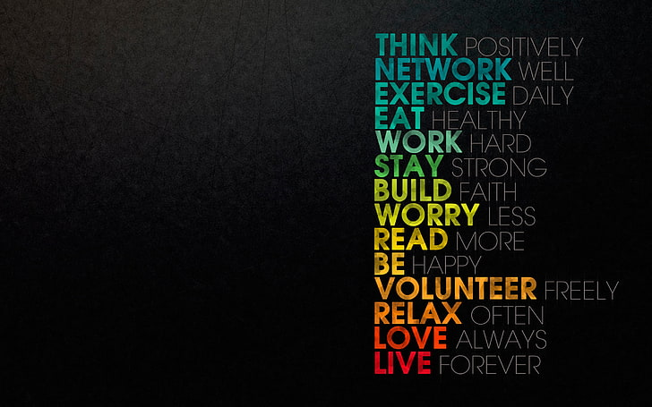

<h1 align="center">📄 Image Text Extraction using Tesseract OCR</h1>

  Extract text from images and visualize detected text regions using OpenCV and Tesseract OCR

<h2>🌟 Highlights</h2>
<ul>
  <li>🧠 <b>OCR Integration</b> – Extract text from images using Tesseract</li>
  <li>📦 <b>Bounding Box Detection</b> – Visualize detected text regions</li>
  <li>🖼️ <b>Image Visualization</b> – Display original and processed images</li>
  <li>⚡ <b>Simple Pipeline</b> – Minimal setup, fast execution</li>
</ul>

<h2>📸 Output Preview</h2>

  
  

  <i>Left: Original Image &nbsp;&nbsp;&nbsp; Right: Detected Text Regions</i>

<h2>📝 Extracted Text Output</h2>

<pre>
 Extracted Text:

THINK POSITIVELY
NETWORK WELL
EXERCISE DAILY
EAT HEALTHY
WORK HARD
STAY STRONG
BUILD FAITH
WORRY LESS
READ MORE

BE HAPPY
VOLUNTEER FREELY
RELAX OFTEN

LOVE ALWAYS
LIVE FOREVER

</pre>

<h2>ℹ️ How It Works</h2>
<ul>
  <li>Load image using OpenCV</li>
  <li>Convert image from BGR → RGB</li>
  <li>Use Tesseract to extract text</li>
  <li>Detect word-level bounding boxes</li>
  <li>Draw rectangles around detected text</li>
</ul>

<h2>🧱 Tech Stack</h2>
<ul>
  <li>Python</li>
  <li>OpenCV</li>
  <li>Tesseract OCR</li>
  <li>Matplotlib</li>
</ul>

<h2>⬇️ Setup Instructions</h2>

<h3>1️⃣ Install Dependencies</h3>
<pre><code>pip install opencv-python pytesseract matplotlib</code></pre>

<h3>2️⃣ Install Tesseract OCR</h3>
<ul>
  <li>Windows: <a href="https://github.com/UB-Mannheim/tesseract/wiki">Download Installer</a></li>
  <li>Linux:
    <pre><code>sudo apt install tesseract-ocr</code></pre>
  </li>
  <li>Mac:
    <pre><code>brew install tesseract</code></pre>
  </li>
</ul>

<h3>3️⃣ Set Environment Variable</h3>

Set your Tesseract path:

<pre><code># Windows (PowerShell)
setx TESSERACT_PATH "C:\Program Files\Tesseract-OCR\tesseract.exe"

# Linux / Mac
export TESSERACT_PATH=/usr/bin/tesseract
</code></pre>

<h2>▶️ Run the Project</h2>

<pre><code>python main.py</code></pre>

Make sure your image file (e.g., <b>1.jpg</b>) is in the same directory.

<h2>📁 Project Structure</h2>

<pre>
project/
├── main.py
├── 1.jpg
├── images/
│   ├── original.png
│   └── with_boxes.png
</pre>

<h2>💡 Notes</h2>
<ul>
  <li>Accuracy depends on image quality</li>
  <li>Works best with clear, high-resolution text</li>
  <li>You can extend it for PDFs, real-time camera OCR, etc.</li>
</ul>

<h2>💭 Contributing</h2>

Feel free to improve the project by adding features like:

<ul>
  <li>📷 Live camera OCR</li>
  <li>📄 PDF text extraction</li>
  <li>🌐 Multi-language support</li>
</ul>

<b>Let’s build something useful 🚀</b>

<h2>👤 Author</h2>

  <b>Rohit Manoj Nair</b>

   
  Email: rohitmknair@gmail.com

   
  LinkedIn: https://www.linkedin.com/in/rohit-manoj/

